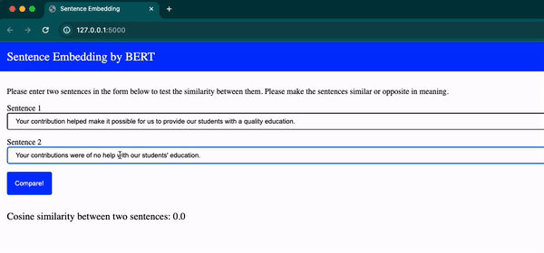

# Sentence Embedding with BERT

Submitted by: Sunil Prajapati (st124073)

## Rep Structure

<pre>
root
|--<a href="https://github.com/scherbatsky-jr/nlp-text-generator/blob/main/LSTM_LM.ipyng">Task_1.ipynb (Building own Model)</a>
|--<a href="https://github.com/scherbatsky-jr/nlp-text-generator/blob/main/app">Task_2,3.ipynb (Using pretrained models and comparison)</a>
|--<a href="https://github.com/scherbatsky-jr/nlp-text-generator/blob/main/app">app</a>
    |--<a href="https://github.com/scherbatsky-jr/nlp-text-generator/blob/main/app/lib">lib</a>
    |--<a href="https://github.com/scherbatsky-jr/nlp-text-generator/blob/main/app/static">static</a>
    |--<a>templates</a>
    |   |--<a href="https://github.com/scherbatsky-jr/nlp-text-generator/blob/main/app/templates/index.html">index.html</a>
    |
    |--<a href="https://github.com/scherbatsky-jr/nlp-text-generator/blob/main/app/app.py">main.py</a>
</pre>

## Datasets
The datasets used to train the model is Sample Wiki available in Hugging Face. It is available at: https://huggingface.co/datasets/embedding-data/simple-wiki

## Comparision of Models

| Model | Training Loss | Training Accuracy | Average Evaluation Cosine Similarity |
|-------|---------------|-------------------|----------------|
| Model from Scratch | 2.782414 | 30 % | 0.99 |
| Pretrained Model | 1.206007 | 33.8% | 0.6190 |

### Running the app

To run the app, go to app folder

`cd app`

Run the app using command

`python main.py`

### Demo

